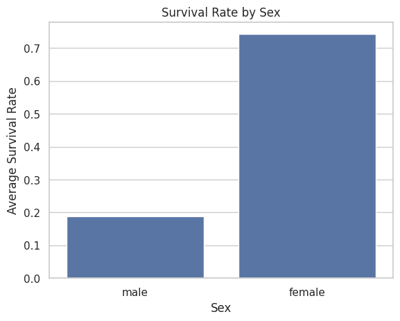
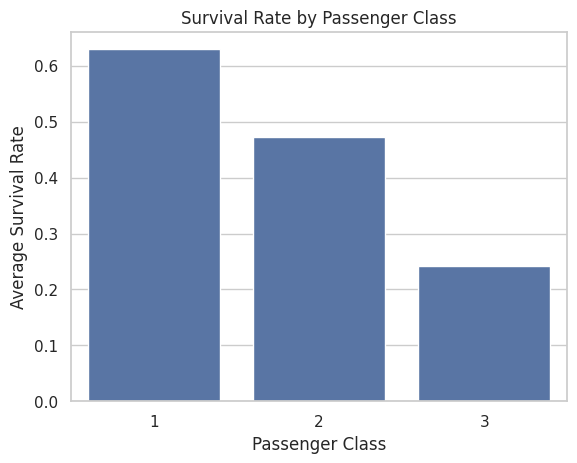
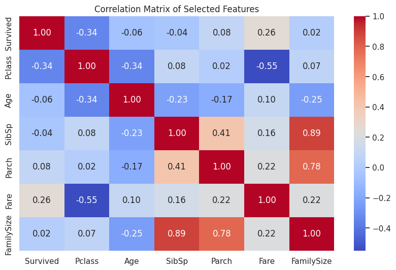
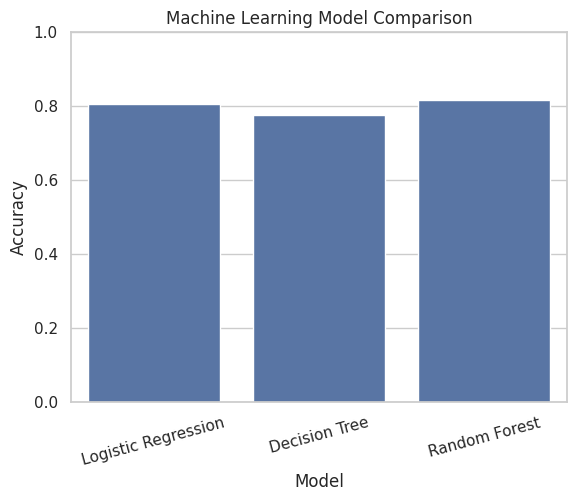

# 🚢 Titanic Survival Prediction

An end-to-end **Machine Learning** project using the famous **Titanic dataset** from Kaggle. This project demonstrates the complete Data Science workflow, including **data cleaning**, **exploratory data analysis (EDA)**, **feature engineering**, **machine learning**, and **model evaluation**.

---

## 📌 Project Overview

The goal of this project is to predict whether a passenger survived the Titanic disaster using machine learning techniques.

This project covers:

- 🧹 Data Cleaning
- 📊 Exploratory Data Analysis (EDA)
- ⚙️ Feature Engineering
- 🤖 Machine Learning
- 📈 Model Evaluation
- 🏆 Model Comparison

---

## 📂 Dataset

**Source:** Titanic Dataset (Kaggle)

The dataset contains passenger information such as:

- Passenger Class
- Age
- Sex
- Fare
- Embarkation Port
- Family Information

Target Variable:

**Survived**

- 0 → Did Not Survive
- 1 → Survived

---

## 🛠 Technologies Used

- Python
- Pandas
- NumPy
- Matplotlib
- Seaborn
- Scikit-Learn
- Google Colab
- Git
- GitHub

---

## 🧹 Data Cleaning

The following preprocessing steps were performed:

- Removed duplicate rows
- Handled missing values
- Removed the Cabin column
- Filled missing Age values using the median
- Filled missing Embarked values using the mode
- Validated data types
- Checked numerical ranges
- Verified missing values
- Saved the cleaned dataset

---

## 📊 Exploratory Data Analysis

The following analyses were performed:

- Overall Survival Analysis
- Survival by Gender
- Survival by Passenger Class
- Age Distribution
- Fare Analysis
- Embarkation Port Analysis
- Family Size Analysis
- Correlation Heatmap

---

## ⚙️ Feature Engineering

A new feature was created:

```python
FamilySize = SibSp + Parch + 1
```

This feature represents the total number of family members traveling with each passenger.

---

## 🤖 Machine Learning Models

Three machine learning models were trained and evaluated.

| Model | Accuracy | Precision | Recall | F1 Score |
|------|---------:|----------:|--------:|---------:|
| Logistic Regression | 80.45% | 79.31% | 66.67% | 72.44% |
| Decision Tree | 77.65% | 71.64% | 69.57% | 70.59% |
| **Random Forest** | **81.56%** | **78.13%** | **72.46%** | **75.19%** |

---

## 🏆 Best Model

**Random Forest** achieved the best overall performance.

### Final Performance

- ✅ Accuracy: **81.56%**
- ✅ Precision: **78.13%**
- ✅ Recall: **72.46%**
- ✅ F1 Score: **75.19%**

---

## 📈 Visualizations

### Survival by Gender



---

### Survival by Passenger Class



---

### Correlation Heatmap



---

## 📊 Confusion Matrices

### Logistic Regression


---

### Decision Tree


---

### Random Forest


---

### Model Comparison



---

## 📂 Project Structure

```text
Titanic-Survival-Prediction/
│
├── data/
│   ├── train.csv
│   ├── Titanic_clean.csv
│   └── Titanic_clean_with_features.csv
│
├── images/
│   ├── confusion_matrix.png
│   ├── correlation_heatmap.png
│   ├── model_comparison.png
│   ├── survival_by_class.png
│   └── survival_by_gender.png
│
├── notebook/
│   └── Titanic_Survival_Prediction.ipynb
│
├── README.md
├── requirements.txt
└── LICENSE
```

---

## 🔄 Project Workflow

```text
Raw Dataset
      │
      ▼
Data Cleaning
      │
      ▼
Exploratory Data Analysis
      │
      ▼
Feature Engineering
      │
      ▼
Machine Learning
      │
      ▼
Model Evaluation
      │
      ▼
Model Comparison
      │
      ▼
Best Model Selection
```

---

## 🔍 Key Findings

- Female passengers had a significantly higher survival rate than male passengers.
- First-class passengers survived more often than third-class passengers.
- Higher ticket fares were associated with higher survival rates.
- Family size showed an association with survival.
- Random Forest achieved the highest overall performance among the evaluated models.

---

## 🚀 Future Improvements

Possible future improvements include:

- Hyperparameter Tuning
- Cross Validation
- XGBoost
- LightGBM
- Feature Selection
- Model Deployment using Streamlit

---

## 👨‍💻 Author

**Abdalkarim Maher Abu Mashyaekh**

Computer Science Student

---

⭐ If you found this project interesting, feel free to **star the repository**.
